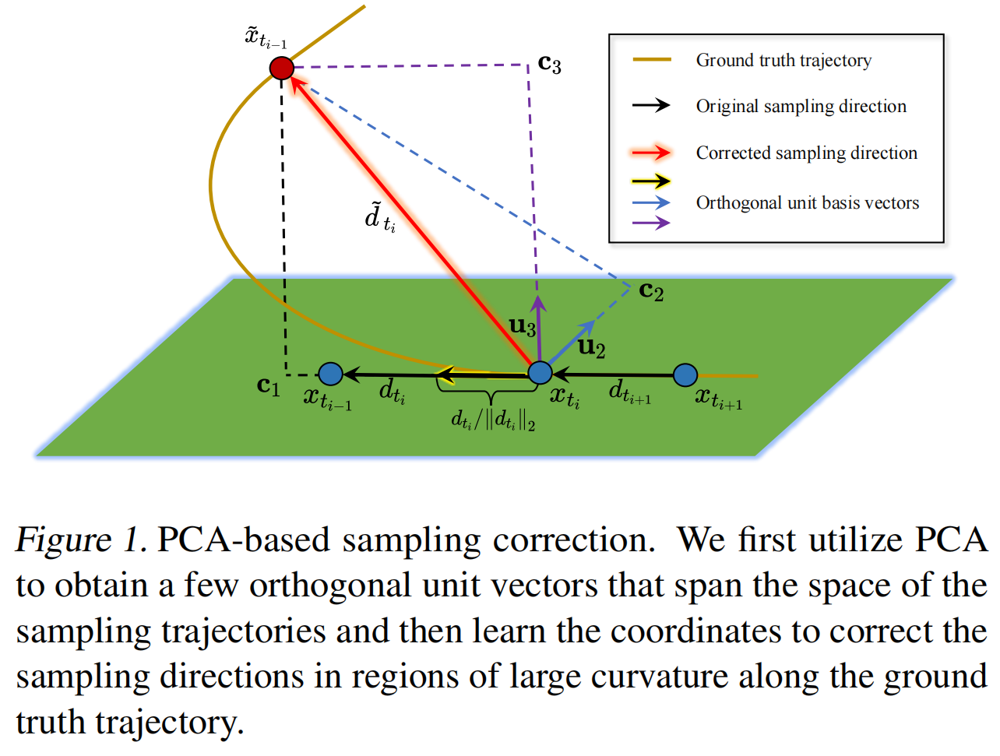
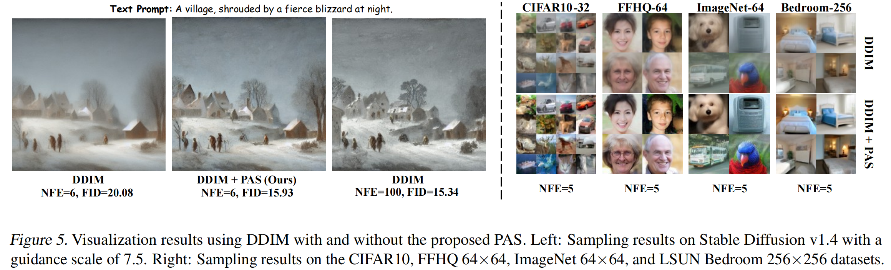

# Diffusion Sampling Correction via Approximately 10 Parameters<br><sub>Official PyTorch implementation of the [ICML 2025](https://openreview.net/forum?id=yPhAbeQxbJ) paper</sub>

🔗 **Links**  
- 📄 **ArXiv**: [arxiv.org/abs/2411.06503](https://arxiv.org/abs/2411.06503)  
- 📝 **OpenReview**: [openreview.net/forum?id=yPhAbeQxbJ](https://openreview.net/forum?id=yPhAbeQxbJ)  
- 📧 **Contact**: [wangguangyi@stu.xmu.edu.cn](mailto:wangguangyi@stu.xmu.edu.cn)

# Introduction
**PAS** (PCA-based Adaptive Search) is a plug-and-play training paradigm designed to accelerate sampling of diffusion models with *minimal learnable parameters and training costs*. It uses PCA to extract a few basis vectors to span the high-dimensional sampling space, allowing the correction of the sampling direction with only a set of coordinates. Additionally, PAS leverages an adaptive search strategy to enhance sampling efficiency and reduce storage requirements. For example, PAS improves DDIM's FID on CIFAR10 from 15.69 to 4.37 in 10 NFE with just *12 parameters* and *under a minute of training* on a single A100 GPU.


# Usage
This code is based on modifications of the [diff-solvers-main](https://github.com/zju-pi/diff-sampler/tree/main/diff-solvers-main). If you encounter any unforeseen issues, please refer to the code repository. We use [pytorch_fid](https://github.com/mseitzer/pytorch-fid) to get the FID. Thank you for using our code!

## Environment
This codebase primarily refers to the diff-solvers-main repository. Please refer to the [README.md](https://github.com/zju-pi/diff-sampler/blob/main/diff-solvers-main/README.md) in the diff-solvers-main repository for environment setup instructions. Notably, the versions of the packages we used are provided in the `environment.yml` file.

## Resources
The codebase will automatically download the checkpoints for CIFAR10, FFHQ, ImageNet, LSUN Bedroom, and Stable Diffusion used in the paper. For the npz statistics file used to compute FID, you can also find it in the [README.md](https://github.com/zju-pi/diff-sampler/blob/main/diff-solvers-main/README.md) in the diff-solvers-main repository. Please download the [FID statistics](https://drive.google.com/drive/folders/1f8qf5qtUewCdDrkExK_Tk5-qC-fNPKpL) to the `stats` directory.

## Run the Code
We provide all hyperparameters (including dataset, NFE, learning rate, etc.) along with explanations in the `run.sh` script, which contains a loop. You can freely modify the hyperparameters as desired and then run `bash run.sh` to obtain the desired experimental results.

# Results


# Acknowledgements
This repo relies on the following existing codebases:
- [diff-solvers-main](https://github.com/zju-pi/diff-sampler/tree/main/diff-solvers-main)
- [EDM](https://github.com/NVlabs/edm) ([Elucidating the Design Space of Diffusion-Based Generative Models](https://arxiv.org/abs/2206.00364))

# Citation
If you use this code for your research, please consider citing the paper:

```bibtex
@inproceedings{wang2025diffusion,
  title={Diffusion Sampling Correction via Approximately 10 Parameters},
  author={Guangyi Wang and Wei Peng and lijiang Li and Wenyu Chen and Yuren Cai and Song-Zhi Su},
  booktitle={Forty-second International Conference on Machine Learning},
  year={2025},
  url={https://openreview.net/forum?id=yPhAbeQxbJ}
}
